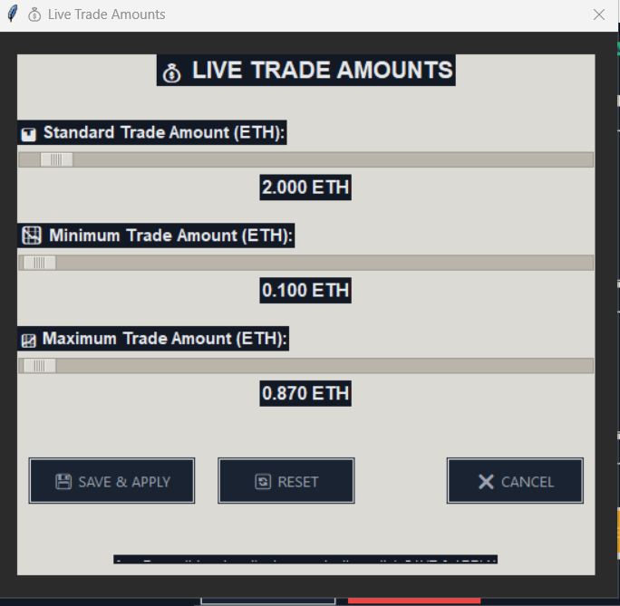
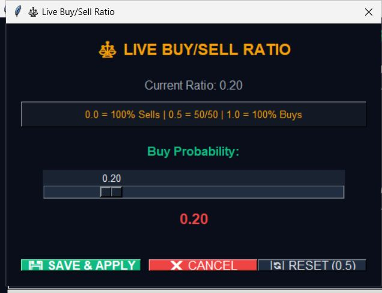
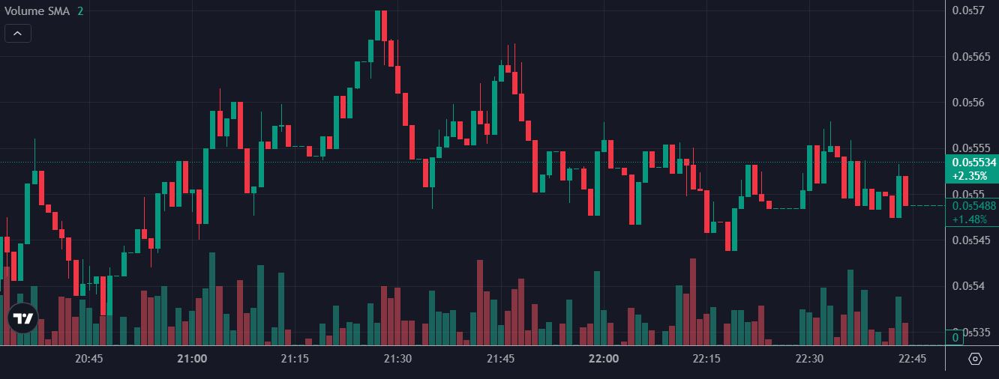

# 🦄 Dr. Einhorn Trading & Analysis Software  
**Professional Trading Analytics & Pool Monitoring Suite**

The **Dr. Einhorn Trading & Analysis Software** is a full-featured management and monitoring tool designed for decentralized liquidity pools.  
It provides complete real-time insight and control over trading activity, price stabilization, and automated liquidity operations.

---

## 🖥️ Interface Overview

### 🔹 Main Control Section
| Button | Description |
|--------|--------------|
| **START MONITOR** | Activates live pool monitoring. Begins scanning all swaps, external buys, and liquidity changes in real time. |
| **STOP** | Halts all running processes instantly, including monitoring and trading threads. |
| **TEST MODE** | Enables sandbox mode — allows simulated trade execution without sending real transactions. |
| **BOT CONFIG** | Opens the trading configuration panel. Here users define runtime, trade amount, min/max sizes, thread count, and buy/sell ratio. |
| **KILL BOT** | Immediately terminates all bot instances and resets internal threads. |
| **LP APPROVE** | Sends an approval transaction to allow liquidity pool access for the configured router or factory. |
| **CHECK NONCES** | Fetches and displays the live nonce count from all internal wallets for precise sequencing. |
| **RESET POOL** | Clears all active positions, resets liquidity, and updates the config JSON. |
| **FAUCET** | Provides test liquidity (test networks only). Automatically refills internal wallets. |
| **LIVE RATIO** | Displays the current buy/sell ratio in real time. |
| **LIVE AMOUNTS** | Shows and dynamically adjusts min/max trading limits during runtime. |
| **RATE LIMIT** | Limits the number of trades per minute across all wallets to avoid spam or overload. |
| **RESET TAXES** | Resets tax and fee counters to zero. |
| **CREATE TOKEN** | Opens the token creation window — instant token deployment with optional pool creation. |
| **CREATE POOL** | Initializes a new liquidity pool with custom ETH/token ratios. |
| **LEGACY BOT** | Starts compatibility mode for legacy modules. |
| **KILL LEGACY** | Terminates legacy mode and resets its configuration. |

---

### 📊 Statistics Section
Displays live blockchain metrics such as:
- **Blocks**, **Swaps**, **External Buys**
- **Last Block**, **Runtime**, **LP Pulls**
- **Tax & Cost Tracking** for gas and trading fees in real time

---

### 🧮 Target Stabilization
Allows automatic market correction toward a target price.
- Set **Target USD Price** and **Tolerance (%)**
- Click **Enable Target** to let the bot balance buy/sell ratios  
  and maintain the price inside the defined corridor.

---

### ⚙️ Configuration Panel
Shows current setup data:
- **Pool Address**
- **Token Address**
- **Number of Internal Wallets**
- **Active/Inactive Test Mode**

---

### 📈 Market Chart & Event Log

**Continuous Price Chart**  
Displays live token price and volume updates (up to 720 data points).  

**Event Log**  
Lists every detected transaction, swap, nonce check, or external buy in chronological order.  
Each entry includes a timestamp and concise execution result for precise monitoring.

---
# ⚙️ Core Algorithms & Trading Logic

This section describes the internal mechanisms and logic behind the **Dr. Einhorn Trading & Analysis Software**.  
All parameters, limits, and runtime behaviors can be adjusted in real time through dedicated control panels.

---

## 🧩 Trading Bot Configuration

The configuration module defines the bot’s runtime, trading amount, and operational behavior.

### Key Parameters
| Setting | Description |
|----------|--------------|
| **Trading Mode** | Choose between **Pump (Buy Only)**, **Dump (Sell Only)**, or **Normal (Buy & Sell)** modes. |
| **Runtime (Minutes)** | Total session duration before automatic shutdown. |
| **Trade Amount (ETH)** | Standard value used for each buy/sell action. |
| **Min / Max Trade Amount (ETH)** | Defines the dynamic lower and upper range for trade amounts. |
| **Max Threads** | Number of parallel worker instances for multi-wallet trading. |
| **Sell-on-Buy** | Optional reactive selling mechanism triggered after a buy event within a given time window. |
| **Buy/Sell Ratio** | Sets probability distribution (0 = Sell Only, 0.5 = Balanced, 1 = Buy Only). |
| **Pool Selection** | Automatic pool detection or manual selection for advanced users. |

---

## 📉 Live Trade Amounts

This module enables real-time adjustment of trade amounts during runtime.  
All changes are written directly into the configuration JSON and reflected immediately in the trading loop.

- **Standard Trade Amount** – Base trade size  
- **Minimum / Maximum** – Dynamic bounds for randomization  
- **Save & Apply** – Writes new values without stopping active threads  

---

## ⚖️ Live Buy/Sell Ratio

This interface allows live modification of the market behavior:
- **Buy Probability (0 – 1)** directly changes trade direction tendency.  
- Real-time adjustments influence the next execution cycles instantly.  
- Supports both manual control and automated re-balancing through the target stabilization system.

---

## 🚦 Trade Rate Limiter

A core safety system that prevents over-trading and simulates natural market rhythm.

| Setting | Function |
|----------|-----------|
| **Enable Rate Limiter** | Activates trade pacing control globally. |
| **Max Trades / Minute** | Defines the upper limit of allowed executions. |
| **Min Interval Between Trades** | Global cooldown (seconds) shared across all wallets. |
| **Organic Trading (Auto-Distribute Evenly)** | Randomizes trade delays using internal λ₁/λ₂ functions to emulate human timing. |

---

## 🎯 Target Price Stabilization

This module continuously monitors on-chain prices and balances the buy/sell ratio  
to maintain the desired target value within a tolerance corridor.

- **Target USD Price** – Price goal in USD  
- **Tolerance (%)** – Acceptable deviation range  
- **Active Status** – Displays mode, ratio, and live range limits  

When enabled, the bot self-adjusts:
if current_price < target - tolerance → increase Buy ratio
if current_price > target + tolerance → increase Sell ratio

## 🪙 Token & Pool Creation

Instantly deploy new tokens and initialize liquidity pools directly from the GUI.

- **Token Name / Symbol / Supply** — basic ERC-20 parameters  
- **Optional Pool Creation** — automatic pairing with ETH after deployment  
- **Create Token** — deploys the smart contract and registers it in the system configuration  

---

## 📜 Event Log & Market Visualization

The log panel records every execution and system message in real time:
- Price updates, nonce checks, and transaction results  
- Target enable/disable events  
- Thread lifecycle management (PID tracking)

---

## 📊 Real-Time Chart Example

Charts illustrate how the stabilization engine interacts with the market.  
Candlestick and volume data reflect organic trading distribution and ratio-based control.

---

## 🧠 Algorithmic Foundation

The trading engine combines deterministic logic with probabilistic modeling:
λ₁ = trade_interval_random(min,max)
λ₂ = adaptive_delay(fee_pressure, gas_limit)

P(buy) = ratio * (1 - λ₁)
P(sell) = (1 - ratio) * λ₂

A simplified **Bellman–Ford** pathfinding adaptation ensures optimal transaction timing across multiple wallets  
to simulate realistic, human-like trading behavior without direct arbitrage objectives.

---
A simplified **Bellman–Ford** pathfinding adaptation ensures optimal transaction timing across multiple wallets  
to simulate realistic, human-like trading behavior without direct arbitrage objectives.

---
---

## 🧩 System Sentinel: The Role of the Rate Limiter

The **Rate Limiter** in Dr. Einhorn is not just a safety switch — it acts as a **sentinel layer**  
between the trading threads and the blockchain execution queue.

While each bot instance runs independently, generating buy/sell orders according to the ratio logic,  
the **sentinel** intercepts and evaluates every pending trade request before it is submitted on-chain.

### 🧠 Functional Overview
- The limiter **does not stop the bots** — they continue to run, collect data, and generate signals.
- Instead, it **filters** which trades are actually allowed to pass based on:
  - The current **max trades per minute**,
  - The **minimum interval** between all trades (global cooldown),
  - And the current **buy/sell ratio state**.
- When the limit is reached, subsequent trades are **temporarily delayed** rather than canceled.
  This keeps the internal statistics coherent and prevents artificial volume spikes.

### 🎯 Core Purpose
By controlling transaction throughput without pausing execution,  
the Rate Limiter ensures:
1. **Ratio Stability** – maintains a consistent buy/sell distribution even under heavy load.  
2. **Organic Flow** – trades appear human and evenly spaced across wallets.  
3. **Gas Efficiency** – redundant or spammy transactions are automatically throttled.

In essence, the sentinel serves as the **rhythm keeper** of the entire system —  
letting the bots "think" freely while ensuring that only the right trades reach the network at the right time.

---
---

## 🛰️ Pool Monitor & Reaction System

The **Pool Monitor** acts as a continuous guardian process, analyzing every swap and liquidity event in real time.  
It is directly connected to the blockchain via RPC/WebSocket and reacts instantly to external activity in the tracked pool.

### 🔍 Core Behavior

The monitor continuously checks:
- Incoming and outgoing swaps  
- LP (liquidity pool) changes  
- External wallet interactions  
- Unusual gas or timing patterns (potential sniper bot behavior)

Depending on the **active mode**, the reaction differs:

---

### 🚀 Pump Mode (Buy-Only Protection)
When operating in **Pump Mode**, the monitor functions as an emergency defense system.  
If an external sniper bot or high-frequency buy is detected:

- The monitor **immediately triggers pool liquidation** (removes all liquidity).  
- **All bot processes are terminated instantly.**  
- This ensures **no further trades can be executed**, effectively freezing the market.  
- Purpose: protect the project and liquidity from sniper exploitation during critical early phases.

---

### ⚖️ Normal Mode (Balanced Trading)
In **Normal Mode**, the monitor behaves passively but remains active in the background.

- On suspicious or external trade detection, it **stops the internal bot execution** safely.  
- The **GUI remains active**, allowing manual inspection and quick restart.  
- This ensures stability without losing analytics or monitoring visibility.  

---

### 🔒 Dump Mode (Sell-Only)
In **Dump Mode**, the monitor is **inactive** — it does not intervene with pool or bot processes.  
This mode is typically used for controlled liquidity exits or stress tests.

---

### 🧠 Purpose
The monitor creates a protective perimeter around automated trading logic.  
By dynamically halting, isolating, or shutting down processes based on context,  
it prevents unwanted interference while keeping the system transparent and under full user control.

---

