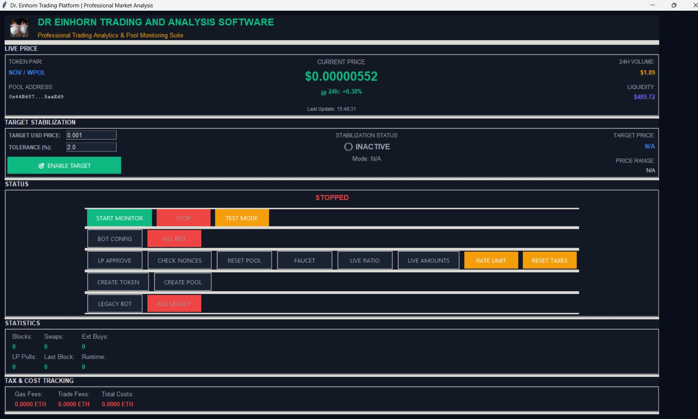
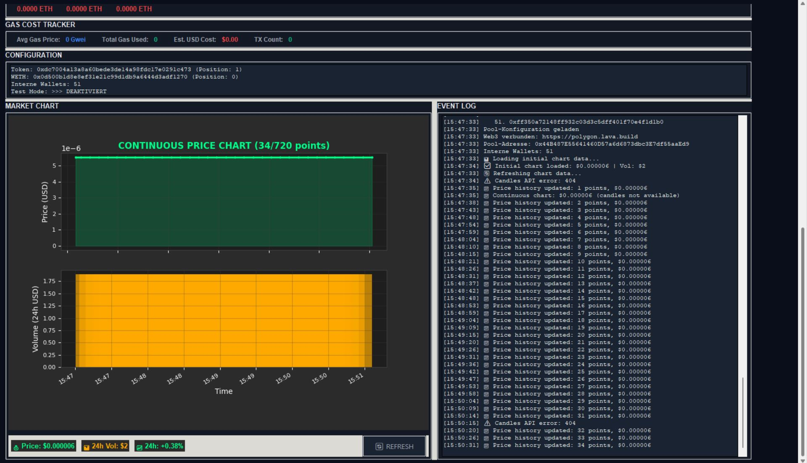

# 🦄 Dr. Einhorn Trading & Analysis Software  
**Professional Trading Analytics & Pool Monitoring Suite**

The **Dr. Einhorn Trading & Analysis Software** is a full-featured management and monitoring tool designed for decentralized liquidity pools.  
It provides complete real-time insight and control over trading activity, price stabilization, and automated liquidity operations.

---

## 🖥️ Interface Overview

### 🔹 Main Control Section
| Button | Description |
|--------|--------------|
| **START MONITOR** | Activates live pool monitoring. Begins scanning all swaps, external buys, and liquidity changes in real time. |
| **STOP** | Halts all running processes instantly, including monitoring and trading threads. |
| **TEST MODE** | Enables sandbox mode — allows simulated trade execution without sending real transactions. |
| **BOT CONFIG** | Opens the trading configuration panel. Here users define runtime, trade amount, min/max sizes, thread count, and buy/sell ratio. |
| **KILL BOT** | Immediately terminates all bot instances and resets internal threads. |
| **LP APPROVE** | Sends an approval transaction to allow liquidity pool access for the configured router or factory. |
| **CHECK NONCES** | Fetches and displays the live nonce count from all internal wallets for precise sequencing. |
| **RESET POOL** | Clears all active positions, resets liquidity, and updates the config JSON. |
| **FAUCET** | Provides test liquidity (test networks only). Automatically refills internal wallets. |
| **LIVE RATIO** | Displays the current buy/sell ratio in real time. |
| **LIVE AMOUNTS** | Shows and dynamically adjusts min/max trading limits during runtime. |
| **RATE LIMIT** | Limits the number of trades per minute across all wallets to avoid spam or overload. |
| **RESET TAXES** | Resets tax and fee counters to zero. |
| **CREATE TOKEN** | Opens the token creation window — instant token deployment with optional pool creation. |
| **CREATE POOL** | Initializes a new liquidity pool with custom ETH/token ratios. |
| **LEGACY BOT** | Starts compatibility mode for legacy modules. |
| **KILL LEGACY** | Terminates legacy mode and resets its configuration. |

---

### 📊 Statistics Section
Displays live blockchain metrics such as:
- **Blocks**, **Swaps**, **External Buys**
- **Last Block**, **Runtime**, **LP Pulls**
- **Tax & Cost Tracking** for gas and trading fees in real time

---

### 🧮 Target Stabilization
Allows automatic market correction toward a target price.
- Set **Target USD Price** and **Tolerance (%)**
- Click **Enable Target** to let the bot balance buy/sell ratios  
  and maintain the price inside the defined corridor.

---

### ⚙️ Configuration Panel
Shows current setup data:
- **Pool Address**
- **Token Address**
- **Number of Internal Wallets**
- **Active/Inactive Test Mode**

---

### 📈 Market Chart & Event Log

**Continuous Price Chart**  
Displays live token price and volume updates (up to 720 data points).  

**Event Log**  
Lists every detected transaction, swap, nonce check, or external buy in chronological order.  
Each entry includes a timestamp and concise execution result for precise monitoring.

---
